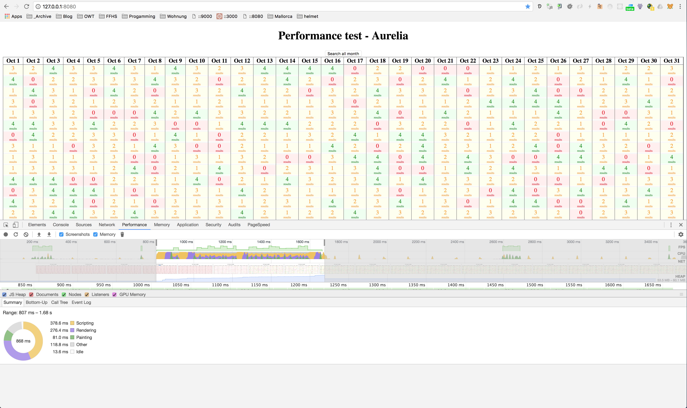

## Propose

Test Aurelia regarding a performance test described in this [article](https://itnext.io/angular-5-vs-react-vs-vue-6b976a3f9172).

The Aurelia boilerplate used for this test [aurelia-typescript-boilerplate](https://github.com/w3tecch/aurelia-typescript-boilerplate).

## Usage
Clone this repo and then

```shell
yarn install
npm start
```

Then visit [127.0.0.1:8080](http://127.0.0.1:8080)

## Result ~900ms

